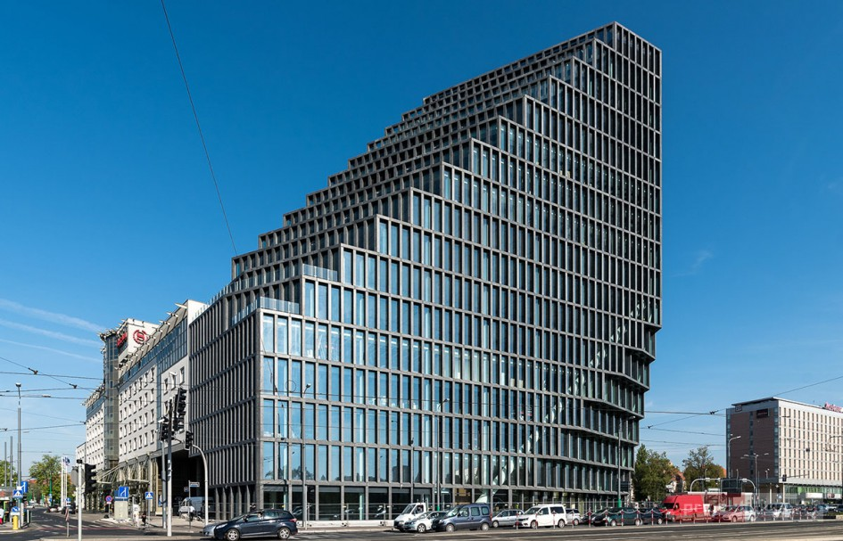
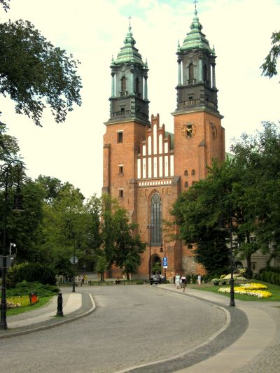
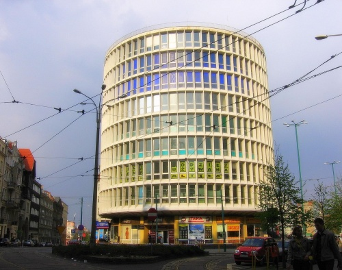
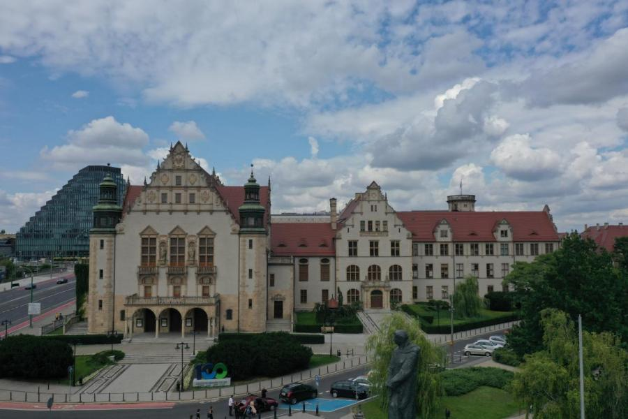

# Project Name
> This is a project for Advanced image processing course on PUT.
> It is an image classification using BoVW model ( Bag of Visual Words)
## Table of contents
* [General info](#general-info)
* [Based on](#Based on)
* [Images used to train](@Images)
* [Setup](#setup)
* [Features](#features)
* [Status](#status)
* [Inspiration](#inspiration)


## General info
If something is unclear just ask :) 

The BoVW is implemented as a python class (DataDescriber) which is compatible witch sklearn Pipeline which make it super easy to use parameters searching.


The target is to make image classification for five classes which are building in Poznań city:
1. Hotel Bałtyk
2. Katedra on Ostrów Tumski
3. Okrąglak
4. Teatr Wielki
5. Uniwerystet Adama Mickiwicza

If you need the dataset for training just contact me.

Algorithm summary:

1. Creating image features using OpenCV SIFT detector and descriptor, but using only 500 best features for each photo.
2. After all features are collected I'm making a clustering using sklearn MiniBatchKMeans algorithm (2000 clusters) to create a vocabulary model.
3. Transform image features into a histogram of "words" occurring in each photo using trained vocabulary model.
4. Final step is to train a classifier where X is a histogram of words appearing on an image and y are labels for image.


## Based on
* SIFT detector/descriptor - https://en.wikipedia.org/wiki/Scale-invariant_feature_transform
* MiniBatch K-Means algorithm - https://en.wikipedia.org/wiki/K-means_clustering
* LinearSVC classifier - https://en.wikipedia.org/wiki/Support_vector_machine#Linear_SVM

## Train Images
1. Hotel Bałtyk

2. Katedra on Ostrów Tumski

3. Okrąglak

4. Teatr Wielki

5. Uniwerystet Adama Mickiwicza


## Setup
Best way is just to run your IDE and let it install _requirements.txt_

but if you want to do it manually you need:
```bash
pip3 install -Iv opencv-contrib-python==4.4.0.46
pip3 install -Iv numpy==1.19.4
pip3 install -Iv colorama==0.4.4
pip3 install -Iv scikit-learn==0.23.2
pip3 install -Iv tqdm==4.54.1
pip3 install -Iv scipy==1.5.4
pip3 install -Iv pandas==1.1.5
pip3 install -Iv sklearn==0.0
```

## Code Examples
_make_classification_ is the function where all magic does.
As I said earlier the BoVW is in python class called _DataDescriber_ you can use it in your project as an image transformer.

To train your classifier you need to specify path to directory with images in calsses

```python
data_path = Path('train/')  # You can change the path here
```

## Features
List of features ready and TODOs for future development
* Can do classification with accuracy about 90%
* Training do not take a while

To-do list:
* Cut down size of classifier (probably with _enter_ _exit_ statement)
* Add prediction function to _DataDescriber_

## Status
* TODO: as in Features To Do. Feel free to ask and pull requests.
* Finished: General concept

## Inspiration
Project is inspired by Dominik Pieczyński, the course leader:) 


